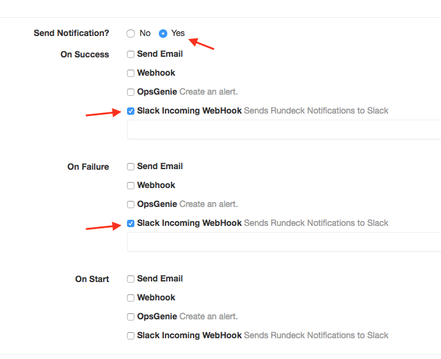
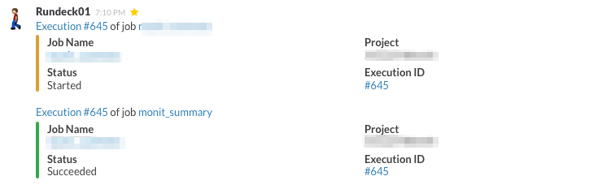
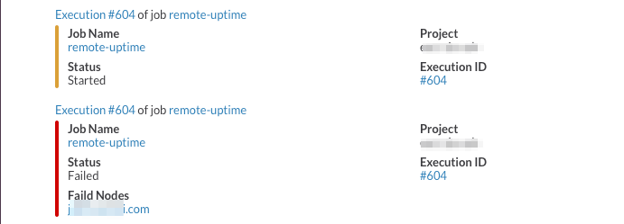

rundeck-slack-incoming-webhook-plugin
======================

Sends rundeck notification messages to a slack channel.  This plugin  is based on [rundeck-slack-plugin](https://github.com/bitplaces/rundeck-slack-plugin)(based on run-hipchat-plugin).

This fork was created to work around a bug in Rundeck where Instance (or default) scoped PluginProperties weren't supporting being set at the Framework or Project level.
This fork removes the per-job URL input field and instead requires it to be set at the Framework (`framework.properties`) or Project level.

Installation Instructions
-------------------------

See the [Included Plugins | Rundeck Documentation](http://rundeck.org/docs/plugins-user-guide/installing.html#included-plugins "Included Plugins") for more information on installing rundeck plugins.

## Download jarfile

1. Download jarfile from [releases](https://github.com/higanworks/rundeck-slack-incoming-webhook-plugin/releases).
2. copy jarfile to `$RDECK_BASE/libext`

## Build

1. build the source by gradle.
2. copy jarfile to `$RDECK_BASE/libext`


## Configuration
This plugin uses [Slack incoming-webhooks](https://skedulo.slack.com/apps/A0F7XDUAZ-incoming-webhooks). Create a new configuration and copy the webhook url.

To set the webhook URL for all jobs add the following to `framework.properties`:
```
framework.plugin.Notification.SlackNotification.webhook_url=<WEBHOOK_URL>
```

To set the webhook URL on a per-project basis edit the `project.properties` configuration. This is possible in the web UI at https://YOUR_RUNDECK_HOSTNAME/project/PROJECT_NAME/configure and clicking **Edit Configuration File** in the top right corner.

Any value set at the project level will override the framework level setting.

```
project.plugin.Notification.SlackNotification.webhook_url=<WEBHOOK_URL>
```

Then enable Slack notifications for each job:



## Slack message example.

On success.



On failure.



## Contributors
*  Original [hbakkum/rundeck-hipchat-plugin](https://github.com/hbakkum/rundeck-hipchat-plugin) author: Hayden Bakkum @hbakkum
*  Original [bitplaces/rundeck-slack-plugin](https://github.com/bitplaces/rundeck-slack-plugin) authors
    *  @totallyunknown
    *  @notandy
    *  @lusis
*  @sawanoboly
